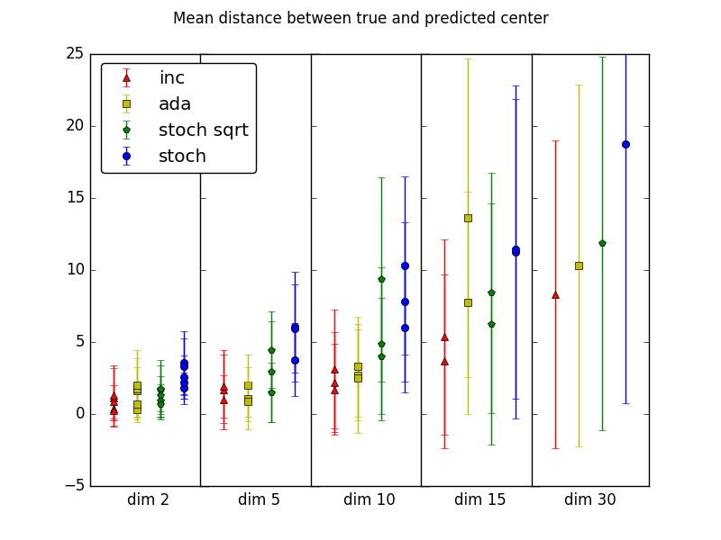
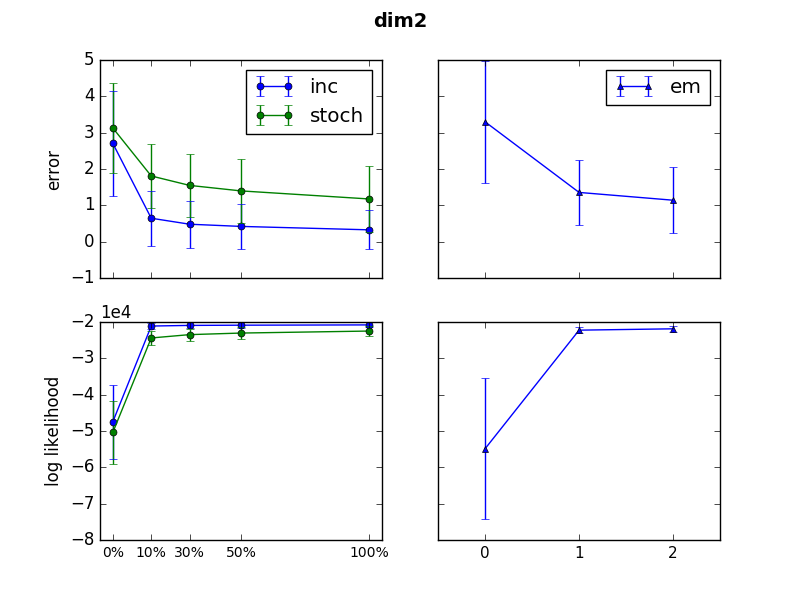
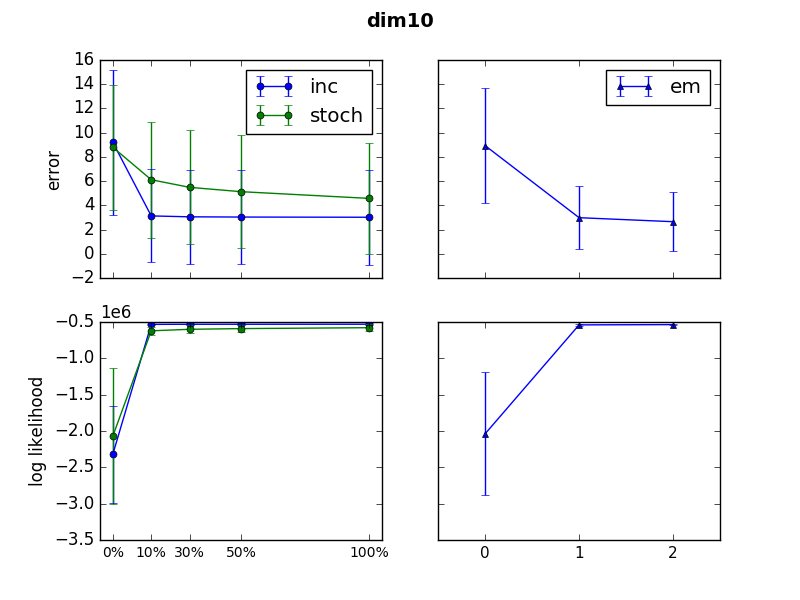

# EM

This project was focused on comparing stochastic optimization approaches in Expectation-Maximization algorithm. Here the following algorithm are implemented:
* classic EM algorithm (classic_em.py)
* simple stochastic gradient EM algorithm (stoch_em.py)
* EM algorithm with adadelta optimization (adadelta_em.py)
* incremental EM algorithm (incremental_em.py)

The motivation is to make EM algorithm large-scalable, and the common idea is not to use the whole training set for parameter recomputation, but to only take some mini-batch for that (probably even just one element from the set). 

In stochastic gradient EM after usual E-step, we make a step along the gradient in M-step using the mini-batch. The learning rate is computed as c/t where c is some constant and t is the number of iteration. In adadelta approach (see original [paper](http://www.matthewzeiler.com/pubs/googleTR2012/googleTR2012.pdf)), we take the history of the previous gradients into consideration for computng the learning rate on each iteration.

The parameter estimation formulae for GMM have the form of the sum over the data samples, so another non-gradient approach would be to  update the summands correspondent to a randomly chosen mini-batch which is the idea in incremental EM.

####The results of experiments on model data

The comparison of the algorithms' performance on model data sets (dimensions 2, 3, 5, 10, 15, and 30 with 2-5 components in the mixture and 5000-100000 number of observations, running each experiment 20-30 times and taking the average for the results stability):

"stoch sqrt" stands for SGD EM with learning rate c/sqrt(t).

SGD EM with the learning rate (assuming a proper constant is chosen) performs relatively well comparing to Adedelta. Incremental EM noticeably outperforms stochastic gradient EM but this approach is not applicable to all the family of distributions.

It is also interesting to compare SGD EM and incremental EM speed of convergence with that of classic EM. It is noteworthy that in many cases after just one epoch both iEM and SGD EM converged to values at least as good as classic EM after two
passages through dataset. It is notable that quality of SGD EM and incremental EM are fairly close throughout the learning, although incremental EM convergence occurs significantly faster.

   

For more details, see the project [report](report/paper.pdf).
